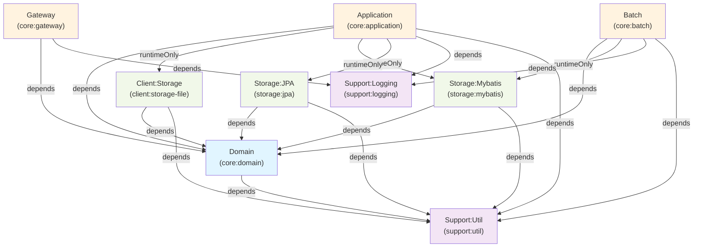

# 아키텍처 (Architecture)

Spring Boot 4 + Kotlin 기반의 헥사고날(Ports & Adapters) 멀티모듈 백엔드 아키텍처입니다. 도메인 로직과 인프라를 명확히 분리하여 테스트 용이성과 확장성을 극대화합니다.

---

## 1. 개요

### 헥사고날 아키텍처 채택 이유

**도메인-인프라 분리**
- 도메인 계층이 외부 프레임워크(Spring, ORM, HTTP)에 의존하지 않음
- 도메인 로직은 순수 Kotlin으로 작성되어 변경에 강함
- 인프라 변경(DB, 메시지 큐 등)이 도메인에 영향을 주지 않음

**테스트 용이성**
- 도메인 모델을 단위 테스트할 때 Spring Context 로드 불필요
- Mock/Fake Adapter로 외부 의존성을 쉽게 치환
- 비즈니스 로직 테스트 실행 속도 향상

**확장성과 유연성**
- 동일한 도메인 포트에 여러 구현(Adapter)을 플러그인 가능
- 새로운 인프라 추가 시 기존 코드 수정 최소화
- 마이크로서비스 분할 시 계층 경계가 명확하여 분리 용이

### 멀티모듈 채택 이유

- **모듈별 독립 빌드**: 변경 영역을 최소화하여 CI/CD 성능 개선
- **의존성 명시화**: Gradle 의존성 선언으로 계층 규칙 강제
- **팀 협업**: 모듈별 담당자 지정 시 변경 충돌 감소
- **재사용성**: 공통 모듈(support)을 여러 서버에서 공유

---

## 2. 레이어 설명

### 2.1 Domain (cc.midolog.core.domain)

**책임**
- 도메인 모델(Entity, Value Object) 정의
- 비즈니스 규칙과 검증 로직
- Port 인터페이스 정의(외부 의존성을 역전시키는 계약)

**특징**
- 순수 Kotlin, 프레임워크 비의존
- Spring 어노테이션 불가
- JPA, Mybatis, 외부 라이브러리 사용 불가
- Port는 domain 내 interface로만 정의

**예시 구조**
```
core/domain/
├── model/
│   ├── User.kt          (Entity)
│   ├── Email.kt         (Value Object)
│   └── Role.kt          (Enum)
├── port/
│   ├── UserRepository.kt    (Output Port)
│   ├── EmailService.kt      (Output Port)
│   └── EventPublisher.kt    (Output Port)
└── service/
    └── UserDomainService.kt (비즈니스 규칙)
```

### 2.2 Application (cc.midolog.core.application)

**책적**
- 유스케이스(Application Service) 구현
- 도메인 서비스 조율
- Adapter(구현체) 주입 및 의존성 해결
- 트랜잭션 관리

**특징**
- Domain에만 의존 (도메인 로직 호출)
- Adapter(client, storage)는 **runtimeOnly**로 의존 (컴파일 의존성 제거)
- Spring Application Context 진입점
- WebFlux + Coroutine 사용

**예시 구조**
```
core/application/
├── config/
│   ├── AdapterConfig.kt     (Adapter 빈 등록)
│   └── SecurityConfig.kt
├── service/
│   ├── CreateUserUseCase.kt (Application Service)
│   └── UpdateUserUseCase.kt
└── ApplicationBootApplication.kt
```

### 2.3 Gateway (cc.midolog.core.gateway)

**책임**
- 외부 HTTP 요청 수신
- 요청 분기(라우팅)
- 트랜잭션 ID 생성 및 Header 전파
- 요청 모니터링/관측성

**특징**
- Spring Cloud Gateway 기반
- 단일 진입점(Single Entry Point)
- 모든 요청에 고유 Transaction ID 부여
- 요청 확인 대시보드 제공

**예시 구조**
```
core/gateway/
├── config/
│   ├── GatewayConfig.kt     (라우팅 규칙)
│   └── TransactionIdFilter.kt (Transaction ID 부여)
├── controller/
│   └── RequestMonitorController.kt (대시보드)
└── GatewayBootApplication.kt
```

### 2.4 Batch (cc.midolog.core.batch)

**책임**
- 배치 작업(정기 데이터 처리)
- 스케줄 작업(Quartz, Spring Scheduler)
- 대용량 데이터 처리

**특징**
- 동기 또는 비동기 실행
- Domain, Storage, Support에 의존
- Application과 독립적으로 구동 가능

**예시 구조**
```
core/batch/
├── config/
│   └── BatchConfig.kt
├── job/
│   ├── DailyReportJob.kt
│   └── DataCleanupJob.kt
└── BatchBootApplication.kt
```

### 2.5 Client (cc.midolog.client.*)

**책임**
- 외부 시스템 API 호출
- HTTP, gRPC, 메시지 큐 등을 통한 통신
- Domain Port 구현(Adapter)

**모듈**
- **client:storage-file** — 파일 스토리지 클라이언트 (S3, GCS 등)

**특징**
- Domain Port를 구현하는 Adapter
- Application에서 runtimeOnly로 의존
- 외부 인증/설정 관리(API Key, Endpoint)

**예시 구조**
```
client/storage-file/
├── config/
│   └── S3ClientConfig.kt
├── adapter/
│   └── S3FileStorageAdapter.kt  (Domain Port 구현)
└── dto/
    └── S3UploadResult.kt
```

### 2.6 Storage (cc.midolog.storage.*)

**책임**
- 데이터 영속성(Database Access)
- Domain Port 구현(Adapter)

**모듈**
- **storage:mybatis** — MyBatis 기반 데이터 접근
- **storage:jpa** — Spring Data JPA 기반 데이터 접근

**특징**
- Domain model을 저장소 전용 schema/entity/mapper에 매핑
- Domain Port(Repository) 구현
- MyBatis SQL query 또는 JPA repository 관리
- Persistence 구현은 profile로 하나만 선택

**예시 구조**
```
storage/mybatis/
├── config/
│   └── MybatisConfig.kt
├── mapper/
│   ├── UserMapper.xml
│   └── UserMapper.kt
├── adapter/
│   └── MybatisUserRepositoryAdapter.kt  (Domain Port 구현)
└── entity/
    └── UserEntity.kt  (DB Mapping)

storage/jpa/
├── config/
│   └── JpaStorageConfig.kt
├── sample/
│   ├── SampleJpaEntity.kt
│   ├── SampleJpaRepository.kt
│   ├── SampleJpaMapper.kt
│   └── JpaSampleRepositoryAdapter.kt  (Domain Port 구현)
└── README.md
```

**Domain/entity 분리 원칙**
- `core:domain`에는 Plain Kotlin/Java model과 port만 둔다.
- JPA `@Entity`, `@Table`, Spring Data repository는 `storage:jpa` 내부에만 둔다.
- MyBatis mapper interface와 XML mapper는 `storage:mybatis` 내부에만 둔다.
- `core:application`은 `SampleRepositoryPort` 같은 domain port만 사용하고 구체 storage 구현을 main source에서 import하지 않는다.
- 운영 실행에서는 `mybatis`와 `jpa` profile을 동시에 켜지 않는다.

### 2.7 Support (cc.midolog.support.*)

**책임**
- 횡단 관심사(Cross-Cutting Concerns)
- 모든 모듈에서 공유하는 유틸리티

**모듈**
- **support:util** — 공통 유틸리티 (String, Date, Collection 등)
- **support:logging** — 통일된 로깅 설정

**특징**
- 프레임워크, 도메인 로직 불포함
- 모든 모듈에서 의존 가능
- 역의존 금지(어떤 상위 모듈도 support를 의존하지 않음)

**예시 구조**
```
support/util/
├── extension/
│   └── StringExt.kt
├── helper/
│   └── DateTimeHelper.kt
└── validator/
    └── EmailValidator.kt

support/logging/
├── config/
│   └── LoggingConfig.kt
├── filter/
│   └── RequestLoggingFilter.kt
└── util/
    └── MdcHelper.kt
```

---

## 3. 의존성 방향 규칙

### 3.1 의존성 흐름

```
상위(실행계층) → 하위(도메인/인프라) 단방향
```

| 계층 | 의존 가능 대상 | 설명 |
|------|-------------|------|
| Gateway | domain, support:logging | 요청 수신 및 분기 |
| Application | domain, (runtimeOnly) client/*, storage/*, support | 비즈니스 로직 조율 |
| Batch | domain, (runtimeOnly) client/*, storage/*, support | 배치 작업 실행 |
| Client/* | domain, support | Domain Port 구현 |
| Storage/* | domain, support | Domain Port 구현 |
| Domain | support:util | 순수 로직, Port 정의 |
| Support | (없음) | 역의존 금지 |

### 3.2 runtimeOnly 의존성

Application, Batch는 Adapter(Client, Storage)를 **runtimeOnly**로 의존합니다.

**의미**
- Compile 시점에는 의존하지 않음 (Adapter 인터페이스 모름)
- Runtime 시점에만 Spring Context를 통해 Adapter 빈 주입

**장점**
- Application이 구현 세부(S3, Mysql 등)를 알지 못함
- 동일한 Domain Port에 여러 구현 가능
- 테스트 시 Mock Adapter로 쉽게 교체

**예시**
```kotlin
// Application은 Domain Port만 사용
@Service
class CreateUserUseCase(
    private val userRepository: UserRepository  // Domain Port (interface)
) {
    suspend fun execute(dto: CreateUserDto): User {
        return userRepository.save(User(...))
    }
}

// Runtime: MyBatis, JPA, Mock 구현 중 하나가 주입됨
// @Bean fun userRepository(): UserRepository = MybatisUserRepositoryAdapter(...)
```

### 3.3 반드시 지켜야 할 규칙

1. **Gateway ↔ Application 직접 의존 금지**: Gateway에서 Application Service를 직접 호출하지 않음. REST Controller를 Application 내에 두거나 별도 계층으로 분리.
2. **Batch ↔ Application 직접 호출 금지**: 동일 로직이 필요하면 Domain Service로 추출.
3. **Client/Storage 간 직접 의존 금지**: 모두 Domain Port를 통해 통신.
4. **Support 역의존 금지**: Support 모듈은 어떤 상위 모듈도 의존하지 않음.
5. **Domain 내 프레임워크 사용 금지**: Spring, JPA, Mybatis 어노테이션 불가.

---

## 4. 의존성 방향 다이어그램



**범례**
- 파란색(Domain): 도메인 계층 — 프레임워크 비의존, 순수 로직
- 보라색(Support): 공통 모듈 — 모든 계층에서 사용 가능, 역의존 금지
- 주황색(실행계층): Gateway, Application, Batch — 요청/작업 실행 진입점
- 초록색(Adapter): Client, Storage — Domain Port 구현

---

## 5. 요청 흐름 개요

### 5.1 일반적인 비즈니스 요청 흐름

```
Client HTTP Request
       ↓
    Gateway (core:gateway)
       ├─ Transaction ID 생성
       ├─ 요청 추적(MDC)
       └─ Application으로 라우팅
            ↓
    Application (core:application)
       ├─ REST Controller 처리
       ├─ Use Case(Application Service) 호출
       │  (Domain Port 인터페이스 사용)
       └─ Response 반환
            ↓
    Domain (core:domain)
       ├─ Entity 생성/검증
       ├─ Business Rule 실행
       └─ Port 호출 (추상적)
            ↓
    Adapter (Client/Storage)
       ├─ Domain Port 구현
       ├─ 외부 시스템 호출 (DB, API 등)
       └─ 결과 반환
            ↓
    Logging (support:logging)
       └─ 트랜잭션 ID와 함께 로그 기록
```

### 5.2 분산 환경에서의 흐름

```
Client Request
       ↓
    Gateway Instance (로드 밸런서 뒤)
       ├─ Transaction ID 생성
       ├─ 라우팅 규칙 적용
       └─ Business Server N으로 분기
            ↓
    Application Instance 1 (무상태)
       ├─ Domain Port 호출
       └─ Response 반환
    
    Application Instance 2 (무상태)
       ├─ Domain Port 호출
       └─ Response 반환
    
    Application Instance N (무상태)
       ├─ Domain Port 호출
       └─ Response 반환
            ↓
    Storage (공유 DB)
       └─ 데이터 영속성
```

### 5.3 배치 작업 흐름

```
Quartz Scheduler / Spring Scheduler
       ↓
    Batch (core:batch)
       ├─ Job 실행
       ├─ Domain Service 호출
       └─ Port 호출 (추상적)
            ↓
    Adapter (Client/Storage)
       ├─ 대용량 데이터 처리
       └─ 결과 저장
            ↓
    Logging (support:logging)
       └─ 배치 완료 로그 기록
```

---

## 6. 설계 원칙

### 6.1 도메인 주도 설계 (Domain-Driven Design)

- 도메인 모델이 비즈니스 규칙의 중심
- Port를 통한 의존성 역전(Dependency Inversion)
- 인프라 변경에 따른 도메인 영향 최소화

### 6.2 무상태 설계 (Stateless)

- Application 인스턴스가 상태를 보유하지 않음
- 수평 확장(Horizontal Scaling) 가능
- 서버 인스턴스 추가/제거 가능

### 6.3 높은 응집도, 낮은 결합도 (High Cohesion, Low Coupling)

- 각 모듈이 명확한 책임 보유
- 모듈 간 의존성 최소화
- 계층 경계를 넘는 직접 접근 금지

### 6.4 테스트 용이성 (Testability)

- Domain을 Spring 없이 단위 테스트 가능
- Mock/Fake Adapter로 외부 의존성 제거
- Integration Test는 Application 계층에서 수행

---

## 7. 모듈 간 통신

### 7.1 상위 계층 → 하위 계층

**인터페이스 기반 호출**
```kotlin
// Application에서 Domain Port 호출
interface UserRepository {  // Domain Port
    suspend fun findById(id: UserId): User?
    suspend fun save(user: User): User
}

// Mybatis Adapter가 구현
@Component
class MybatisUserRepositoryAdapter : UserRepository {
    override suspend fun findById(id: UserId): User? = ...
    override suspend fun save(user: User): User = ...
}
```

### 7.2 하위 계층 → 상위 계층 (포트)

**도메인 이벤트를 통한 느슨한 결합**
```kotlin
// Domain에서 이벤트 발행
class UserCreatedEvent(val userId: UserId, val email: Email)

// Application에서 이벤트 구독
@EventListener
fun onUserCreated(event: UserCreatedEvent) {
    // 메일 발송, 통계 업데이트 등
}
```

---

## 8. 관련 문서

- [MODULE_GUIDE.md](./MODULE_GUIDE.md) — 각 모듈의 상세 가이드 및 사용 방법
- [GATEWAY.md](./GATEWAY.md) — Gateway 라우팅, Transaction ID, 대시보드 설정
- [FUTURE.md](./FUTURE.md) — 향후 계획 (Config Server, 마이크로서비스 분할 등)

---

## 9. 빌드 및 의존성 순서

```
1단계: Support 모듈 빌드
├─ support:util
└─ support:logging

2단계: 기초 계층 빌드
├─ core:domain
├─ client:storage-file
├─ storage:mybatis
└─ storage:jpa

3단계: 실행 계층 빌드
├─ core:application
├─ core:gateway
└─ core:batch
```

Gradle에서 자동으로 의존성 순서대로 빌드합니다.

---

마지막 업데이트: 2026-06-15
