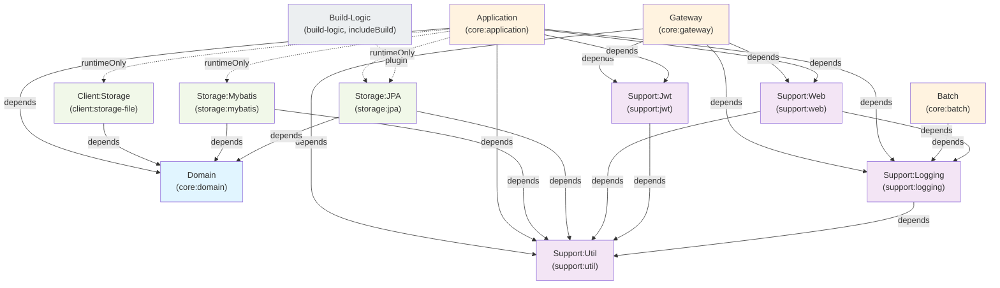

# 아키텍처 (Architecture)

Spring Boot 4 + Kotlin 기반의 헥사고날(Ports & Adapters) 멀티모듈 백엔드 아키텍처입니다. 도메인 로직과 인프라를 명확히 분리하여 테스트 용이성과 확장성을 극대화합니다.

---

## 1. 개요

### 헥사고날 아키텍처 채택 이유

**도메인-인프라 분리**
- 도메인 계층이 외부 프레임워크(Spring, ORM, HTTP)에 의존하지 않음
- 도메인 로직은 순수 Kotlin으로 작성되어 변경에 강함
- 인프라 변경(DB, 메시지 큐 등)이 도메인에 영향을 주지 않음

**테스트 용이성**
- 도메인 모델을 단위 테스트할 때 Spring Context 로드 불필요
- Mock/Fake Adapter로 외부 의존성을 쉽게 치환
- 비즈니스 로직 테스트 실행 속도 향상

**확장성과 유연성**
- 동일한 도메인 포트에 여러 구현(Adapter)을 플러그인 가능
- 새로운 인프라 추가 시 기존 코드 수정 최소화
- 마이크로서비스 분할 시 계층 경계가 명확하여 분리 용이

### 멀티모듈 채택 이유

- **모듈별 독립 빌드**: 변경 영역을 최소화하여 CI/CD 성능 개선
- **의존성 명시화**: Gradle 의존성 선언으로 계층 규칙 강제
- **팀 협업**: 모듈별 담당자 지정 시 변경 충돌 감소
- **재사용성**: 공통 모듈(support)을 여러 서버에서 공유

---

## 2. 레이어 설명

### 2.1 Domain (cc.midolog.core.domain)

**책임**
- 도메인 모델(Entity, Value Object) 정의
- 비즈니스 규칙과 검증 로직
- Port 인터페이스 정의(외부 의존성을 역전시키는 계약)

**특징**
- 순수 Kotlin, 프레임워크 비의존
- Spring 어노테이션 불가
- JPA, Mybatis, 외부 라이브러리 사용 불가
- Port는 domain 내 interface로만 정의

**실제 구조**
```
core/domain/
├── jpadsl/fixture/
│   ├── RelationChild.kt
│   ├── RelationParent.kt
│   └── ScalarSample.kt
├── sample/
│   ├── model/
│   │   └── Sample.kt
│   └── port/
│       ├── cache/
│       │   └── SampleCachePort.kt
│       ├── file/
│       │   └── FileStoragePort.kt
│       └── repository/
│           └── SampleRepositoryPort.kt
└── user/
    ├── model/
    │   └── User.kt
    └── port/repository/
        └── UserRepositoryPort.kt
```

### 2.2 Application (cc.midolog.core.application)

**책임**
- 유스케이스(Application Service) 구현
- 비즈니스 흐름 조율
- Adapter(구현체) 주입 및 의존성 해결
- 트랜잭션 관리

**특징**
- Domain 및 Support(util, logging, web, jwt)에 의존
- Adapter(client, storage)는 **runtimeOnly**로 의존 (컴파일 의존성 제거)
- Spring Application Context 진입점
- WebFlux + Coroutine 사용

**실제 구조**
```
core/application/
├── ApplicationServer.kt
├── business/service/
│   ├── SampleService.kt
│   └── UserService.kt
├── common/security/
│   ├── JwtProvider.kt
│   └── SecurityConfig.kt
├── infra/cache/
│   └── RedisSampleCacheAdapter.kt
└── web/
    ├── auth/
    │   └── AuthController.kt
    ├── sample/
    │   ├── SampleController.kt
    │   ├── SampleStreamController.kt
    │   └── dto/
    │       ├── CreateSampleRequest.kt
    │       └── SampleResponse.kt
    └── user/
        ├── UserController.kt
        └── dto/
            ├── CreateUserRequest.kt
            └── UserResponse.kt
```

### 2.3 Gateway (cc.midolog.core.gateway)

**책임**
- 외부 HTTP 요청 수신
- 요청 분기(라우팅)
- 요청 ID 전파 및 Rate Limiting
- 요청 관측성/가시성(Visibility) 제공

**특징**
- Spring WebFlux / Reactor Netty 기반 자체 프록시 (별도 외부 게이트웨이 의존성 없는 순수 WebFlux 라우팅)
- 단일 진입점(Single Entry Point)
- 모든 요청에 고유 Request ID(`X-Request-Id`) 전파 (`support:web`의 RequestIdFilter 활용)
- 요청 가시성(Visibility) 이벤트 저장소 및 엔드포인트 제공 (`/internal/gateway/requests`, JWT Bearer 인증)
- Redis 기반 Rate Limiting 지원

**실제 구조**
```
core/gateway/
├── GatewayApplication.kt
├── config/
│   ├── GatewayClockConfig.kt
│   ├── GatewayRouteProperties.kt
│   ├── RouteConfig.kt
│   └── WebClientConfig.kt
├── filter/
│   ├── AuthTokenRateLimitFilter.kt
│   └── JwtAuthFilter.kt
├── proxy/
│   ├── HeaderSanitizer.kt
│   └── ProxyHandler.kt
├── ratelimit/
│   ├── RateLimiter.kt
│   └── RedisRateLimiter.kt
├── route/
│   └── GatewayRouteSelector.kt
└── visibility/
    ├── RequestEventStore.kt
    ├── RequestVisibilityController.kt
    ├── RequestVisibilityEvent.kt
    ├── RequestVisibilityFilter.kt
    └── RequestVisibilityProperties.kt
```

### 2.4 Batch (cc.midolog.core.batch)

**책임**
- 정기 배치 작업 및 데이터 처리
- 스케줄 작업(Spring Batch, Spring Scheduler)
- 대용량 데이터 일괄 처리

**특징**
- Spring Batch 기반 Job/Step 실행
- `support:logging`만 의존 (Domain, Storage에 직접 의존하지 않음)
- Application 및 Gateway와 독립적으로 구동 가능한 단독 부트 애플리케이션

**실제 구조**
```
core/batch/
├── BatchApplication.kt
└── batch/job/
    └── SampleJobConfig.kt
```

### 2.5 Client (cc.midolog.client.*)

**책임**
- 외부 시스템 API 호출 및 스토리지 연동
- Domain Port 구현(Adapter)

**모듈**
- **client:storage-file** — 파일 스토리지 클라이언트 (현재 로컬 파일 스토리지 어댑터 제공, 원격 오브젝트 스토리지 연동은 FUTURE 참조)

**특징**
- Domain Port(`FileStoragePort`)를 구현하는 Adapter
- Application에서 runtimeOnly로 의존

**실제 구조**
```
client/storage-file/
└── cc/midolog/client/storage/
    └── LocalFileStorageAdapter.kt
```

### 2.6 Storage (cc.midolog.storage.*)

**책임**
- 데이터 영속성(Database Access)
- Domain Port 구현(Adapter)

**모듈**
- **storage:mybatis** — MyBatis 기반 데이터 접근
- **storage:jpa** — Spring Data JPA 기반 데이터 접근

**특징**
- Domain model을 저장소 전용 schema/entity/mapper에 매핑
- Domain Port(Repository) 구현
- MyBatis SQL query 또는 JPA repository 관리
- Persistence 구현은 profile로 하나만 선택

**실제 구조**
```
storage/mybatis/
├── config/
│   └── MyBatisStorageConfig.kt
├── sample/
│   ├── MyBatisSampleRepositoryAdapter.kt
│   └── SampleMapper.kt
└── user/
    ├── MyBatisUserRepositoryAdapter.kt
    └── UserMapper.kt

storage/jpa/
├── config/
│   └── JpaStorageConfig.kt
├── sample/
│   ├── JpaSampleRepositoryAdapter.kt
│   └── ScalarSampleCodeJpaConverter.kt
└── user/
    └── JpaUserRepositoryAdapter.kt
```
*(참고: JPA Entity, Repository, Mapper는 `build-logic`의 `JpaDslPlugin`에 의해 빌드 시 `build/generated`에 자동 생성됩니다)*

**Domain/entity 분리 원칙**
- `core:domain`에는 Plain Kotlin model과 port만 둔다.
- JPA `@Entity`, `@Table`, Spring Data repository는 `storage:jpa` 내부에만 둔다.
- MyBatis mapper interface와 XML mapper는 `storage:mybatis` 내부에만 둔다.
- `core:application`은 `SampleRepositoryPort`, `UserRepositoryPort` 같은 domain port만 사용하고 구체 storage 구현을 main source에서 import하지 않는다.
- 운영 실행에서는 `mybatis`와 `jpa` profile을 동시에 켜지 않는다.

### 2.7 Support (cc.midolog.support.*)

**책임**
- 횡단 관심사(Cross-Cutting Concerns)
- 여러 모듈에서 공유하는 유틸리티, 로깅, 웹 공통 처리 및 인증 토큰 코덱

**모듈**
- **support:util** — 공통 유틸리티 (String, Date/Time, Collection 확장, 널 안전성, 마스킹, 페이징, 재시도, 유효성 검증 등)
- **support:logging** — 통일된 로깅 설정 (Logback, MDC 바인딩, 개인정보/민감정보 마스킹, Reactor 연동)
- **support:web** — 웹 공통 계층 (RequestIdFilter, HttpLoggingFilter, ErrorCode, GlobalExceptionHandler, ApiResponse)
- **support:jwt** — JWT 공통 유틸리티 (JwtCodec 기반 발급, 파싱, 서명 검증)

**특징**
- 도메인 비즈니스 로직 불포함
- 상위 모듈에서 의존 가능 (단, support 내부에서는 util ← logging, jwt / logging, util ← web 의존)
- 상위 실행/비즈니스 모듈로의 역의존 금지

**실제 구조**
```
support/util/
├── IdGenerator.kt
├── JwtSecretValidator.kt
├── TimeProvider.kt
├── UtilDefaults.kt
├── Validation.kt
├── ext/
│   ├── CollectionExtensions.kt
│   ├── NullSafety.kt
│   └── StringExtensions.kt
├── mask/
│   └── Masking.kt
├── paging/
│   └── Page.kt
├── result/
│   └── Outcome.kt
└── retry/
    └── Retry.kt

support/logging/
├── LoggingMdc.kt
├── MaskingMessageConverter.kt
├── MaskingSupport.kt
└── ReactorMdc.kt

support/web/
├── exception/
│   ├── ApiException.kt
│   └── ErrorCode.kt
├── filter/
│   ├── HttpLoggingFilter.kt
│   └── RequestIdFilter.kt
├── handler/
│   └── GlobalExceptionHandler.kt
└── response/
    └── ApiResponse.kt

support/jwt/
└── JwtCodec.kt
```

---

## 3. 의존성 방향 규칙

### 3.1 의존성 흐름

```
상위(실행계층) → 하위(도메인/인프라) 단방향
```

| 모듈 / 계층 | 의존 대상 (프로젝트) | 설명 |
|------------|-------------------|------|
| `core:gateway` | `support:logging`, `support:util`, `support:web`, `support:jwt` | 요청 수신, 라우팅, Rate Limit, 인증, 관측성 (domain 미의존) |
| `core:application` | `core:domain`, `support:util`, `support:logging`, `support:web`, `support:jwt`, (runtimeOnly) `client:storage-file`, `storage:mybatis`, `storage:jpa` | 비즈니스 유스케이스 조율, REST API 제공, 어댑터 런타임 주입 |
| `core:batch` | `support:logging` | 정기 배치 작업 실행 (Spring Batch 기반, domain/storage 직접 의존 없음) |
| `client:storage-file` | `core:domain` | Domain FileStoragePort 구현 (로컬 파일 스토리지) |
| `storage:mybatis` | `core:domain`, `support:util` | Domain RepositoryPort 구현 (MyBatis SQL 매핑) |
| `storage:jpa` | `core:domain`, `support:util` | Domain RepositoryPort 구현 (Spring Data JPA 및 JPA DSL 생성 코드) |
| `core:domain` | (없음) | 순수 Kotlin 도메인 모델 및 포트 인터페이스 (프로젝트 의존 0) |
| `support:util` | (없음) | 프로젝트 공통 유틸리티 (문자열, 컬렉션, 마스킹 등) |
| `support:logging` | `support:util` | 통합 로깅 및 MDC 유틸리티 |
| `support:web` | `support:logging`, `support:util` | 웹 공통 필터, 응답 래퍼, 전역 예외 처리 |
| `support:jwt` | `support:util` (api) | JWT 인코딩/디코딩 유틸리티 |
| `build-logic` | (Gradle composite build) | JPA DSL 코드 생성 및 Flyway 마이그레이션 검증/생성 플러그인 (`includeBuild`) |

### 3.2 runtimeOnly 의존성

Application, Batch는 Adapter(Client, Storage)를 **runtimeOnly**로 의존합니다.

**의미**
- Compile 시점에는 의존하지 않음 (Adapter 인터페이스 모름)
- Runtime 시점에만 Spring Context를 통해 Adapter 빈 주입

**장점**
- Application이 구현 세부(파일 저장소, DB 등)를 알지 못함
- 동일한 Domain Port에 여러 구현 가능
- 테스트 시 Mock Adapter로 쉽게 교체

**예시**
```kotlin
// Application은 Domain Port만 사용
@Service
class CreateUserUseCase(
    private val userRepository: UserRepository  // Domain Port (interface)
) {
    suspend fun execute(dto: CreateUserDto): User {
        return userRepository.save(User(...))
    }
}

// Runtime: MyBatis, JPA, Mock 구현 중 하나가 주입됨
// @Bean fun userRepository(): UserRepository = MybatisUserRepositoryAdapter(...)
```

### 3.3 반드시 지켜야 할 규칙

1. **Gateway ↔ Application 직접 의존 금지**: Gateway에서 Application Service를 직접 호출하지 않음. REST Controller를 Application 내에 두거나 별도 계층으로 분리.
2. **Batch ↔ Application 직접 호출 금지**: 동일 로직이 필요하면 Domain Service로 추출.
3. **Client/Storage 간 직접 의존 금지**: 모두 Domain Port를 통해 통신.
4. **Support 역의존 금지**: Support 모듈은 어떤 상위 모듈도 의존하지 않음.
5. **Domain 내 프레임워크 사용 금지**: Spring, JPA, Mybatis 어노테이션 불가.

---

## 4. 의존성 방향 다이어그램



**범례**
- 파란색(Domain): 도메인 계층 — 프레임워크 비의존, 순수 로직
- 보라색(Support): 공통 모듈 — 여러 계층에서 공유, 역의존 금지
- 주황색(실행계층): Gateway, Application, Batch — 요청/작업 실행 진입점
- 초록색(Adapter): Client, Storage — Domain Port 구현
- 회색(Build-Logic): Gradle Composite Build — JPA DSL 코드 생성 및 스키마 검증 플러그인

---

## 5. 요청 흐름 개요

### 5.1 일반적인 비즈니스 요청 흐름

```
Client HTTP Request
       ↓
    Gateway (core:gateway)
       ├─ Transaction ID 생성
       ├─ 요청 추적(MDC)
       └─ Application으로 라우팅
            ↓
    Application (core:application)
       ├─ REST Controller 처리
       ├─ Use Case(Application Service) 호출
       │  (Domain Port 인터페이스 사용)
       └─ Response 반환
            ↓
    Domain (core:domain)
       ├─ Entity 생성/검증
       ├─ Business Rule 실행
       └─ Port 호출 (추상적)
            ↓
    Adapter (Client/Storage)
       ├─ Domain Port 구현
       ├─ 외부 시스템 호출 (DB, API 등)
       └─ 결과 반환
            ↓
    Logging (support:logging)
       └─ 트랜잭션 ID와 함께 로그 기록
```

### 5.2 분산 환경에서의 흐름

```
Client Request
       ↓
    Gateway Instance (로드 밸런서 뒤)
       ├─ Transaction ID 생성
       ├─ 라우팅 규칙 적용
       └─ Business Server N으로 분기
            ↓
    Application Instance 1 (무상태)
       ├─ Domain Port 호출
       └─ Response 반환
    
    Application Instance 2 (무상태)
       ├─ Domain Port 호출
       └─ Response 반환
    
    Application Instance N (무상태)
       ├─ Domain Port 호출
       └─ Response 반환
            ↓
    Storage (공유 DB)
       └─ 데이터 영속성
```

### 5.3 배치 작업 흐름

```
Spring Batch / Spring Scheduler
       ↓
    Batch (core:batch)
       ├─ Job 실행
       ├─ Step/Tasklet 실행
       └─ 데이터 처리
            ↓
    Logging (support:logging)
       └─ 배치 완료 로그 기록
```

---

## 6. 설계 원칙

### 6.1 도메인 주도 설계 (Domain-Driven Design)

- 도메인 모델이 비즈니스 규칙의 중심
- Port를 통한 의존성 역전(Dependency Inversion)
- 인프라 변경에 따른 도메인 영향 최소화

### 6.2 무상태 설계 (Stateless)

- Application 인스턴스가 상태를 보유하지 않음
- 수평 확장(Horizontal Scaling) 가능
- 서버 인스턴스 추가/제거 가능

### 6.3 높은 응집도, 낮은 결합도 (High Cohesion, Low Coupling)

- 각 모듈이 명확한 책임 보유
- 모듈 간 의존성 최소화
- 계층 경계를 넘는 직접 접근 금지

### 6.4 테스트 용이성 (Testability)

- Domain을 Spring 없이 단위 테스트 가능
- Mock/Fake Adapter로 외부 의존성 제거
- Integration Test는 Application 계층에서 수행

---

## 7. 모듈 간 통신

### 7.1 상위 계층 → 하위 계층

**인터페이스 기반 호출**
```kotlin
// Application에서 Domain Port 호출
interface UserRepository {  // Domain Port
    suspend fun findById(id: UserId): User?
    suspend fun save(user: User): User
}

// Mybatis Adapter가 구현
@Component
class MybatisUserRepositoryAdapter : UserRepository {
    override suspend fun findById(id: UserId): User? = ...
    override suspend fun save(user: User): User = ...
}
```

### 7.2 하위 계층 → 상위 계층 (포트)

**도메인 이벤트를 통한 느슨한 결합**
```kotlin
// Domain에서 이벤트 발행
class UserCreatedEvent(val userId: UserId, val email: Email)

// Application에서 이벤트 구독
@EventListener
fun onUserCreated(event: UserCreatedEvent) {
    // 메일 발송, 통계 업데이트 등
}
```

---

## 8. 관련 문서

- [MODULE_GUIDE.md](./MODULE_GUIDE.md) — 각 모듈의 상세 가이드 및 사용 방법
- [GATEWAY.md](./GATEWAY.md) — Gateway 라우팅, Transaction ID, 대시보드 설정
- [FUTURE.md](./FUTURE.md) — 향후 계획 (Config Server, 마이크로서비스 분할 등)

---

## 9. 빌드 및 의존성 순서

```
1단계: 빌드 로직 및 기반 모듈
├─ build-logic (includeBuild)
├─ support:util
└─ core:domain

2단계: 지원(Support) 모듈 빌드
├─ support:logging (util 의존)
├─ support:jwt (util 의존)
└─ support:web (logging, util 의존)

3단계: 어댑터(Adapter) 모듈 빌드
├─ client:storage-file (domain 의존)
├─ storage:mybatis (domain, util 의존)
└─ storage:jpa (domain, util 의존)

4단계: 실행 계층 빌드
├─ core:gateway (logging, util, web, jwt 의존)
├─ core:batch (logging 의존)
└─ core:application (domain, logging, util, web, jwt 의존 및 client, storage runtimeOnly)
```

Gradle에서 자동으로 의존성 순서대로 빌드합니다.

---

마지막 업데이트: 2026-09-12
